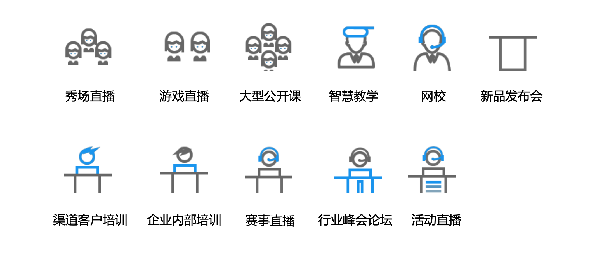

# 3T-Edge直播全链路加速
直播全链路加速产品(3T-Edge)是三体云针对直播场景推出的全链路加速产品，旨在依托三体云遍布全网的加速节点，海量带宽网络等优越的基础设施，日均百万级实时 音视频并发处理能力，为直播类客户提供更快、更稳定的网络接入能力，有效提升直播 应用的可用性和用户体验。

## 应用场景

## 技术优势与特点

**1. 30%超强抗丢包，2.5 秒网络延迟无感知**

**2. 卡顿率降低40%以上**

**3. 端到端延迟降低33%以上**

**4. 通用播放器及通用直播协议，无需特殊协议**

## SDK接口流程

## 接口使用列表

首先保证SDK创建**TTTRtcEngineKit**单例对象 [sharedEngineWithAppId](http://doc3.3ttech.cn/live/client-api/ios/methods.html#sharedEngineWithAppId)

接口列表：

> 1. 设置直播模式 [setChannelProfile](http://doc3.3ttech.cn/live/client-api/ios/methods.html#setChannelProfile)
2. 设置用户角色为主播 [setClientRole](http://doc3.3ttech.cn/live/client-api/ios/methods.html#setClientRole)
3. cdn推流参数设置 [configPublisher](http://doc3.3ttech.cn/live/client-api/ios/methods.html#configPublisher)
4. 设置编码参数 [setVideoProfile](http://doc3.3ttech.cn/live/client-api/ios/methods.html#setVideoProfile1)
5. 开启预览 [startPreview](http://doc3.3ttech.cn/live/client-api/ios/methods.html#startPreview)
6. 显示本地预览 [setupLocalVideo](http://doc3.3ttech.cn/live/client-api/ios/methods.html#setupLocalVideo)
7. 加入频道 [joinChannelByKey](http://doc3.3ttech.cn/live/client-api/ios/methods.html#joinChannelByKey)
8. 更新cdn推流地址 [updateRtmpUrl](http://doc3.3ttech.cn/live/client-api/ios/methods.html#updateRtmpUrl)
9. 离开频道，直播结束 [leaveChannel](http://doc3.3ttech.cn/live/client-api/ios/methods.html#leaveChannel)
10. 停止预览 [stopPreview](http://doc3.3ttech.cn/live/client-api/ios/methods.html#stopPreview)

回调列表：

> 1. 加入房间Error [didOccurError](http://doc3.3ttech.cn/live/client-api/ios/callbacks.html#didOccurError)
2. 加入房间成功 [didJoinChannel](http://doc3.3ttech.cn/live/client-api/ios/callbacks.html#didJoinChannel)
3. 推流成功或失败回调 [reportRtmpStatus](http://doc3.3ttech.cn/live/client-api/ios/callbacks.html#reportRtmpStatus)
4. 异常踢人 [didKickedOutOfUid](http://doc3.3ttech.cn/live/client-api/ios/callbacks.html#didKickedOutOfUid)
5. 网络连接异常 [rtcEngineConnectionDidLost](http://doc3.3ttech.cn/live/client-api/ios/callbacks.html#rtcEngineConnectionDidLost)
6. 网络重连成功 [rtcEngineReconnectServerSucceed](http://doc3.3ttech.cn/live/client-api/ios/callbacks.html#rtcEngineReconnectServerSucceed)
7. 网络重连失败 [rtcEngineReconnectServerTimeout](http://doc3.3ttech.cn/live/client-api/ios/callbacks.html#rtcEngineReconnectServerTimeout)

## 示例程序

#### 准备工作
1. 下载SDK[TTTRtcEngineKit](https://github.com/santiyun/iOS-LiveSDK)和[TTTPlayerKit](https://github.com/santiyun/TTTPlayerKit_iOS)
2. 登录三体云官网 [http://dashboard.3ttech.cn/index/login](http://dashboard.3ttech.cn/index/login) 注册体验账号，进入控制台新建自己的应用并获取APPID。

## 示例工程配置

SDK支持 iOS 8.0+ 真机

把下载的SDK放在demo的**TTTLib**目录下

工程已做如下配置，直接运行工程

1. 设置Bitcode为NO
2. 设置后台音频模式
3. 导入系统库

 * libxml2.tbd
 * libc++.tbd
 * libz.tbd
 * libsqlite3.tbd
 * ReplayKit.framework
 * CoreTelephony.framework
 * SystemConfiguration.framework
